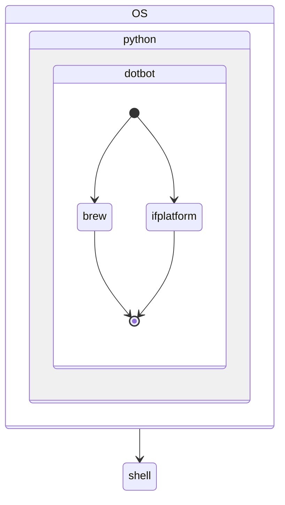

# dotfiles

## 💡 Basic Info

**``$HOME``** sweet home

## 📖 Description

A self-contained technology is used to rapidly obtain a development environment.

## 🎯 Summary

* Install and pre-configure ZSH.
* Install and configure NeoVim to develop in Python. (Also supports other programming languages).
* Configure git.

## 🧬 Project structure

```console
.
|-- README.md
|-- TODO
|-- docs
|   |-- _config.yml
|   `-- index.md
|-- gitconfig
|-- install
|-- install.conf.yaml
|-- nvim
|   |-- coc-settings.json
|   |-- init.vim
|   `-- plugins
|       |-- airline.vim
|       |-- auto-pairs.vim
|       |-- coc.vim
|       |-- dracula.vim
|       |-- floaterm.vim
|       |-- fugitive.vim
|       `-- nerdtree.vim
`-- scripts
    |-- install-yarn.sh
    |-- run-setup.sh
    `-- welcome.sh
```

## 🏛 Architecture



## ⚙️ Setup

Make sure your Operating System has the following packages installed.

1. bash
2. curl
3. git
4. Python

> Most OS have pre-installed with, just make sure!.

## 🍴 Usage

Clone the repository to your `$HOME` directory as `.dotfiles` and then run the installer.

```bash
# Clone
cd ~
git clone https://github.com/gagocaan/dotfiles.git ~/.dotfiles

# Install
~/.dotfiles/install
```

## 🔍 Test

> 🚧 Under construction ...

## 🔨 Develop

> 🚧 Under construction ...
